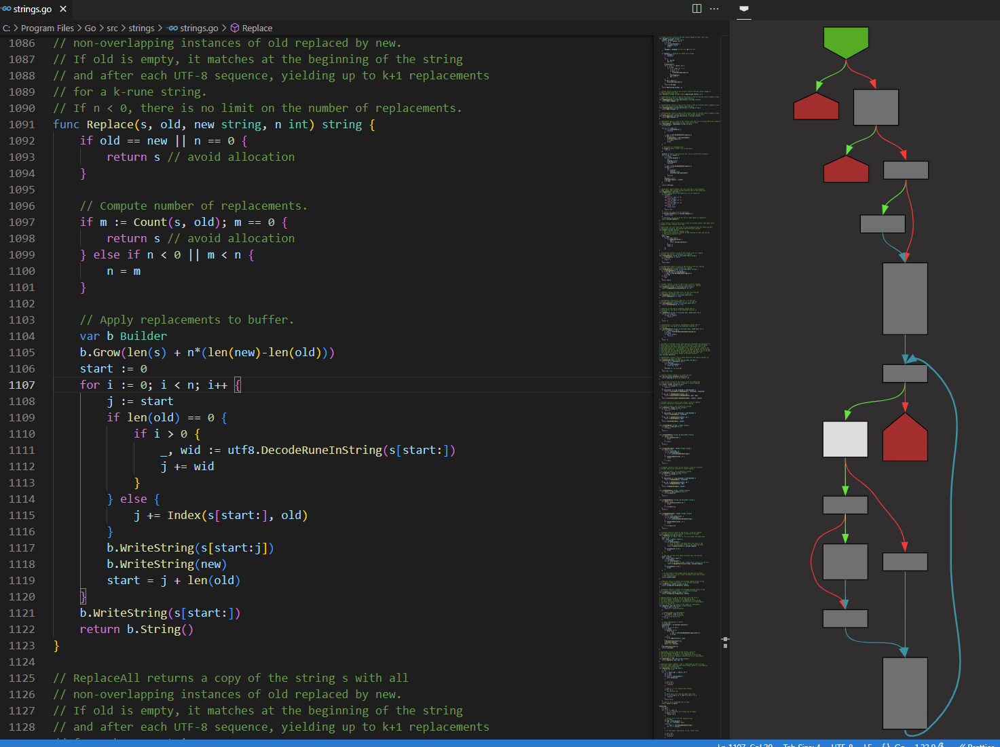
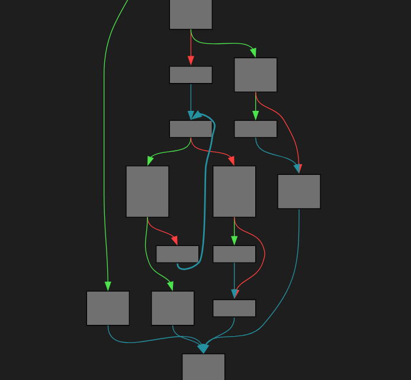
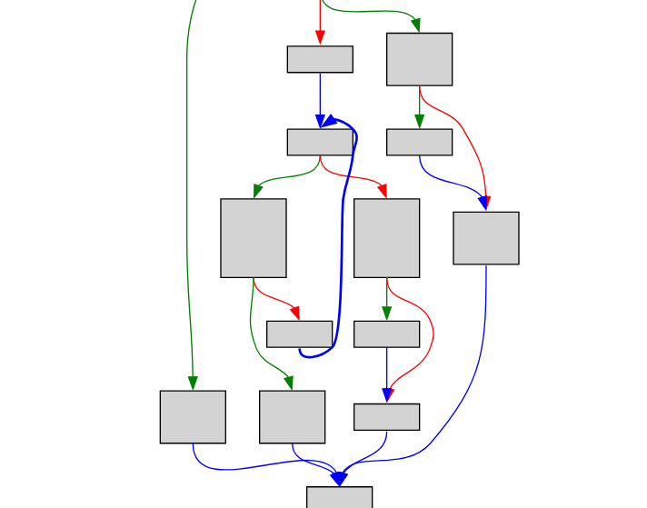
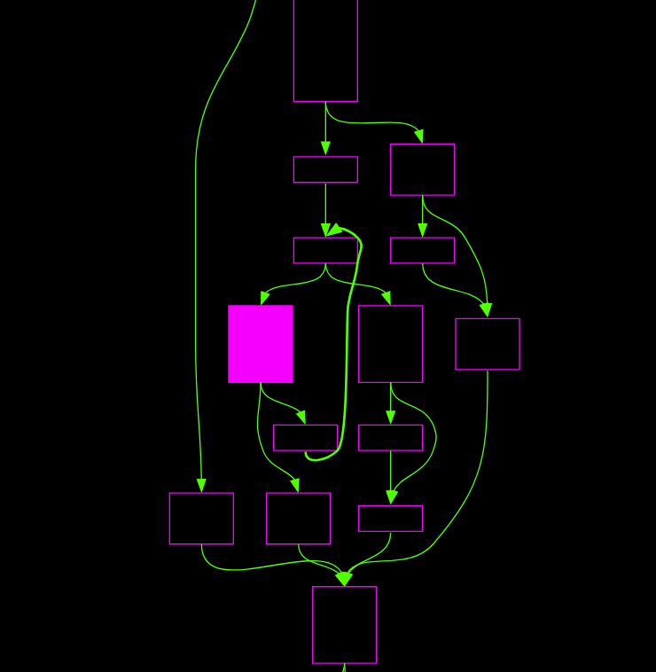
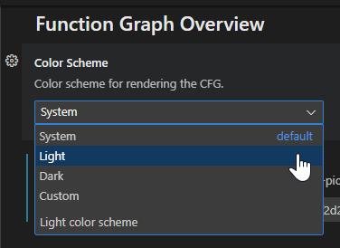
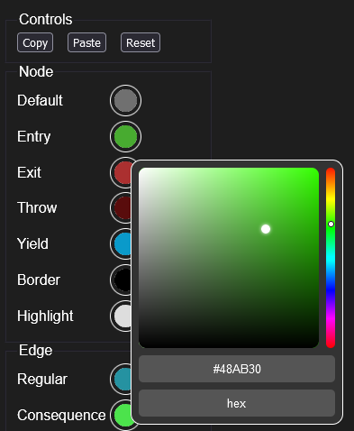
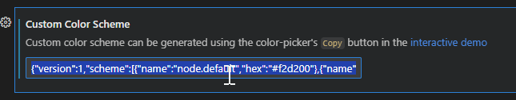

# Function Graph Overview

[Control-flow graph](https://en.wikipedia.org/wiki/Control-flow_graph) visualization for VS Code.

This extension adds a Graph Overview to VS Code, showing the CFG (control-flow graph) for the current function.



## Installation

Install via the [extension page](https://marketplace.visualstudio.com/items?itemName=tamir-bahar.function-graph-overview) at the VSCode Marketplace.

## Demo

You can try it out via an [interactive demo](https://tmr232.github.io/function-graph-overview/) if you don't want to install it.

Note that the demo only supports a single function and ignores the cursor location.

## Dark Mode

Both dark, light, and custom color schemes are supported.

| Dark                                                             | Light                                                              | Custom                                                               |
| ---------------------------------------------------------------- | ------------------------------------------------------------------ | -------------------------------------------------------------------- |
|  |  |  |

By default, the color scheme will match the VSCode theme (light or dark).

You can change to a different preset via the settings:



### Custom Color Schemes

Custom color schems are created via the [interactive demo](https://tmr232.github.io/function-graph-overview/).

1. Enable the `Color Picker` above the graph
2. Select the colors you want for your color scheme<br/>
   
3. Press the `Copy` button to copy the color scheme into the clipboard
4. Paste the config into the `Custom Color Scheme` field in the VSCode extension settings.<br/>
   

## Supported Languages

- [Go](https://tmr232.github.io/function-graph-overview/?language=0)
- [C](https://tmr232.github.io/function-graph-overview/?language=1)
- [C++](https://tmr232.github.io/function-graph-overview/?language=3)
- [Python](https://tmr232.github.io/function-graph-overview/?language=2)

## Development

### Requirements

- [Bun](https://bun.sh/) is required to develop the project.
- [Bun for Visual Studio Code](https://marketplace.visualstudio.com/items?itemName=oven.bun-vscode) is needed for debugging in VS Code
- [emscripted](https://emscripten.org/) is only required if you want to add new tree-sitter parsers.

### Getting Started

Clone the project and install dependencies.

```bash
git clone https://github.com/tmr232/function-graph-overview/
cd function-graph-overview
bun install
```

You can debug the extension via VS Code by pressing F5.

To run the demo, run `bun demo`.
