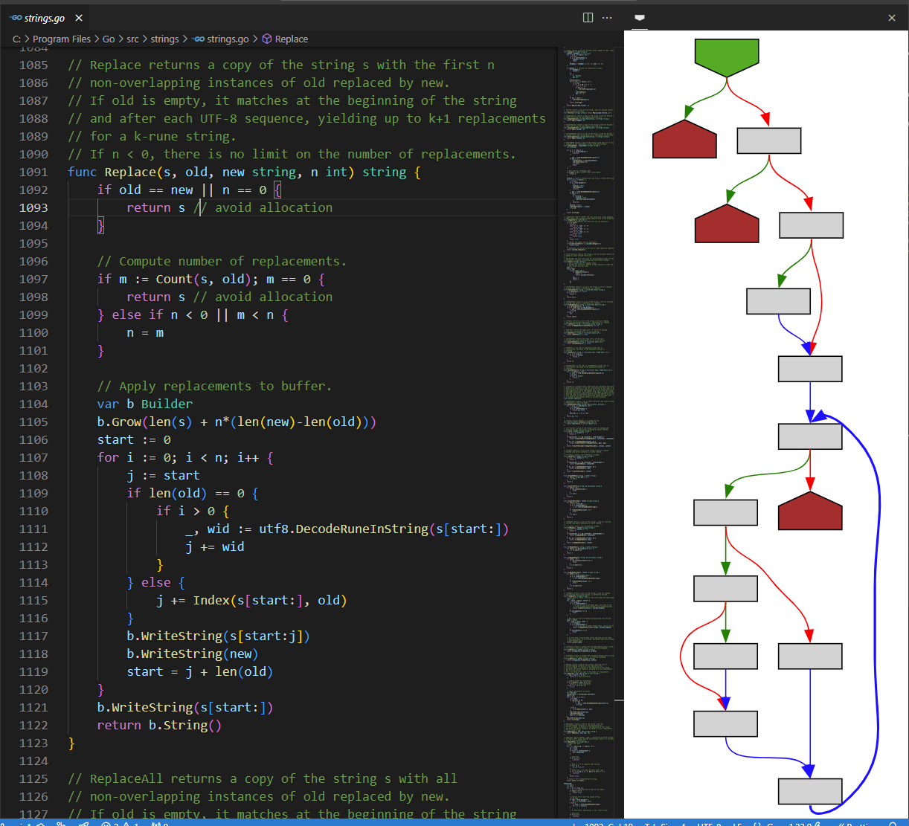

# Function Graph Overview

[Control-flow graph](https://en.wikipedia.org/wiki/Control-flow_graph) visualization for VS Code.

This extension adds a Graph Overview to VS Code, showing the CFG (control-flow graph) for the current function.

## Installation

Install via the [extension page](https://marketplace.visualstudio.com/items?itemName=tamir-bahar.function-graph-overview) at the VSCode Marketplace.

## Demo

You can try it out via an [interactive demo](https://tmr232.github.io/function-graph-overview/) if you don't want to install it.

Note that the demo only supports a single function and ignores the cursor location.

## Supported Languages

- Go
