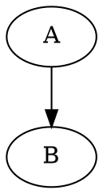
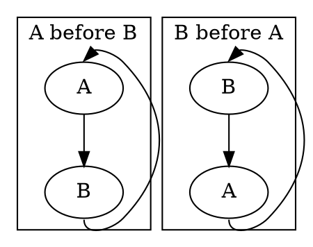
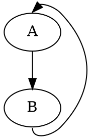

# Graphviz Tips & Tricks

We're using Graphviz DOT to draw our graphs,
so it is a good idea to document important bits of how we make it work well.

## Backlinks

When laying out a directed graph,
DOT uses multiple factors to determine the node hierarchy.
The main two we're concerned with are edge directions and node definition order.

Generally, if a node A has an edge to node B then node B will be lower in the graph.

```
digraph {
    A -> B
}
```



If node B also has an edge to node A, we have a loop.
In that case, layout will be determined by order of definitions.



This forces us to be _very_ careful with node definition order, 
and makes it easy to mess up the layout.
To improve upon this, we use the [`dir`](https://graphviz.org/docs/attrs/dir/) attribute and mark backlinks in a way Graphviz recognizes.

```
digraph {
    edge [headport=n tailport=s]
    A -> B
    A -> B [dir=back headport=s tailport=n]
}
```



This makes it that all edges point down the hierarchy, and avoids ambiguity.

Note that we're explicitly avoiding the [`[constraint=false]`](https://graphviz.org/docs/attrs/constraint/) attribute as it results
in really unwieldy edge layouts.

## IDs and Classes

Graphviz does a fantastic job at generating metadata-rich SVG files.
We use the `class` and `id` attributes in DOT, and they are maintained in the resulting SVG.
This allows us to define classes for use in styling;
and IDs to use for node-highlighting or navigation.