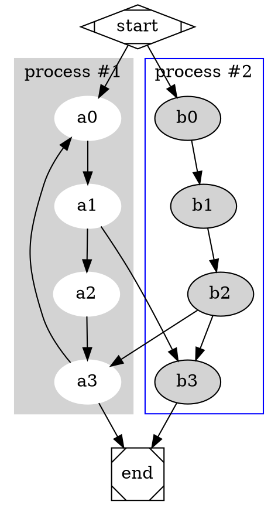

# DOT Generation



```dot-cfg
  
  entry [class="entry"]
  return1 [class="exit"]
  return2 [class="exit"]
  return4_2 [class="exit"]
  entry -> stmt1
  stmt1 -> return1 [class="consequence"]
  stmt1 -> else1 [class="alternative"]
  else1 -> stmt2
  stmt2 -> return2 [class="consequence"]
  stmt2 -> else2 [class="alternative"]
  else2 -> stmt3
  stmt3 -> stmt4_1
  stmt4_1 -> stmt4_2
  stmt4_2 -> return4_2 [class="consequence"]
  stmt4_2 -> else4_2 [class="alternative"]
  else4_2 -> stmt4_3
  stmt4_3 -> stmt4_4
  stmt4_4 -> stmt4_1 [dir="back"]
  
```